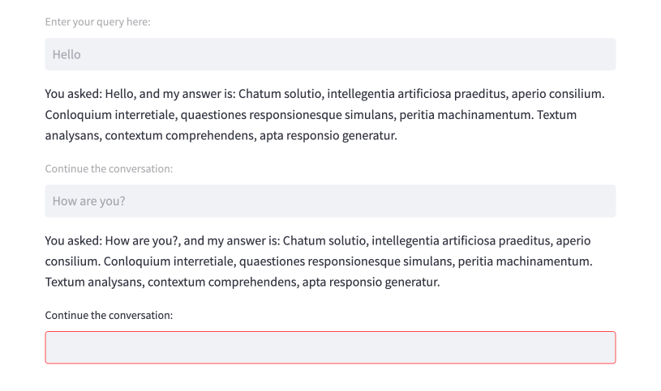

# Streamlit Chatbot

This repository contains an example of a chatbot implementation using Streamlit, a powerful open-source app framework for Machine Learning and Data Science projects. The chatbot provides a user-friendly interface with a text box field for users to input their queries and receive responses from the chatbot.



## Features

- Interactive text box for user input
- Instant response from the chatbot
- Reset the conversation by refreshing the page

## Installation

1. Clone the repository:

   ```
   git clone https://github.com/Elijas/streamlit-chatbot.git
   ```

2. Change the directory:

   ```
   cd streamlit-chatbot
   ```

3. Install the required dependencies:

   ```
   pip install -r requirements.txt
   ```

## Usage

1. Run the Streamlit app:

   ```
   streamlit run app.py
   ```

2. Open the provided URL in your web browser.

3. Start interacting with the chatbot by typing your queries in the text box and pressing Enter.

4. To reset the conversation, simply refresh the page.